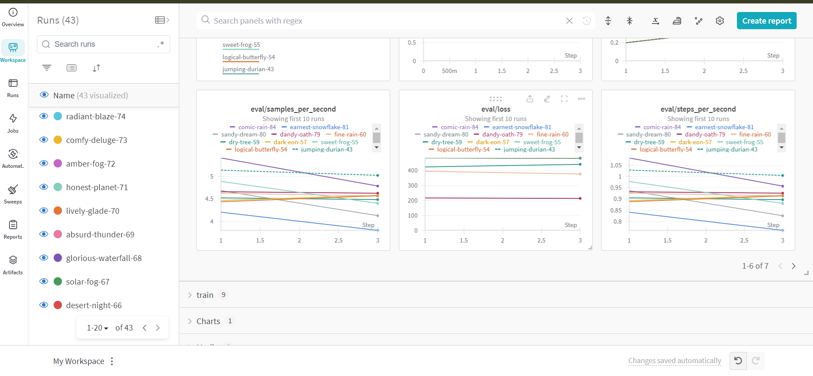
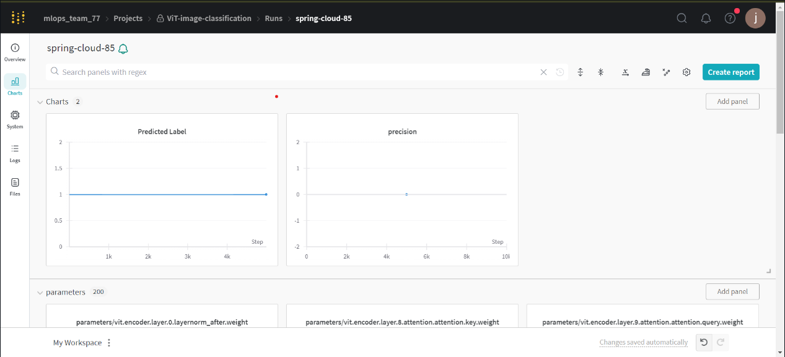
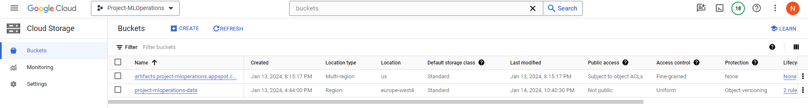
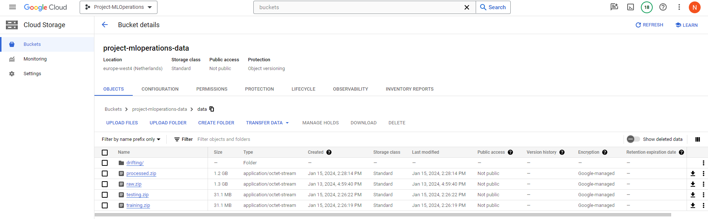
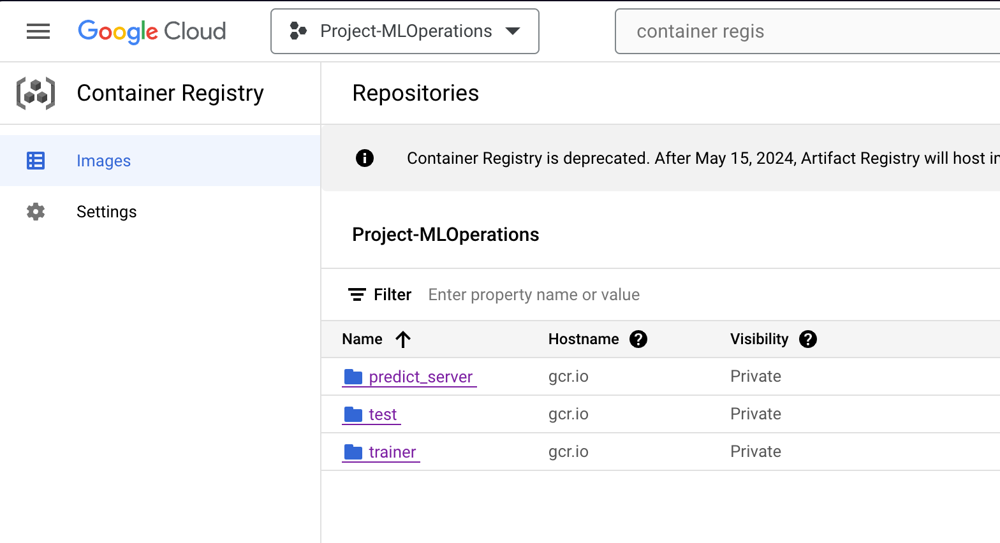
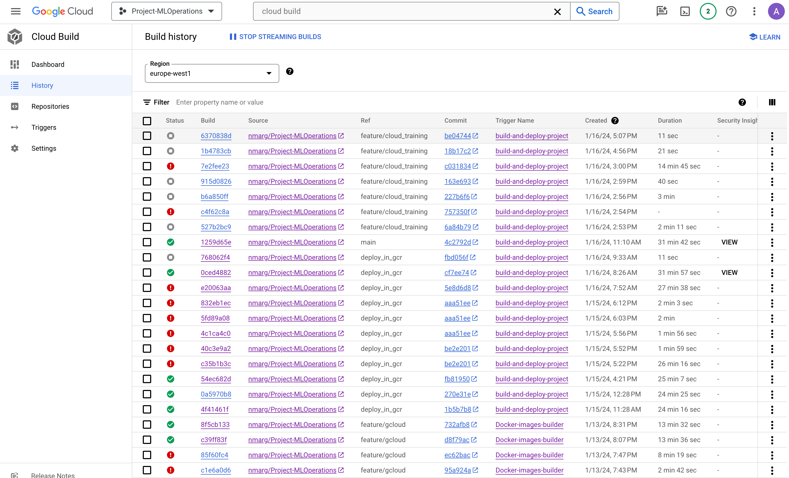
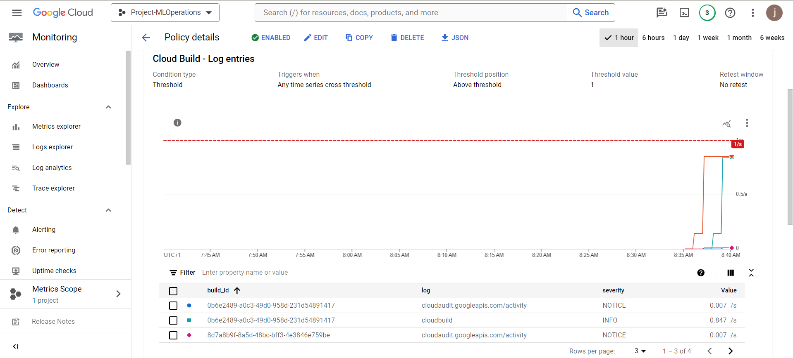
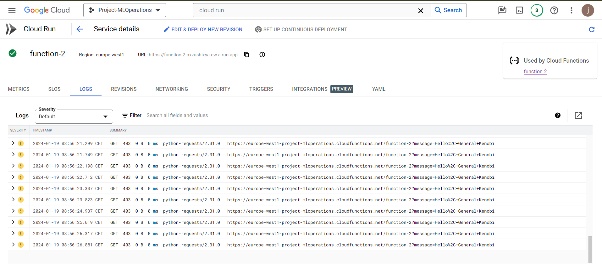
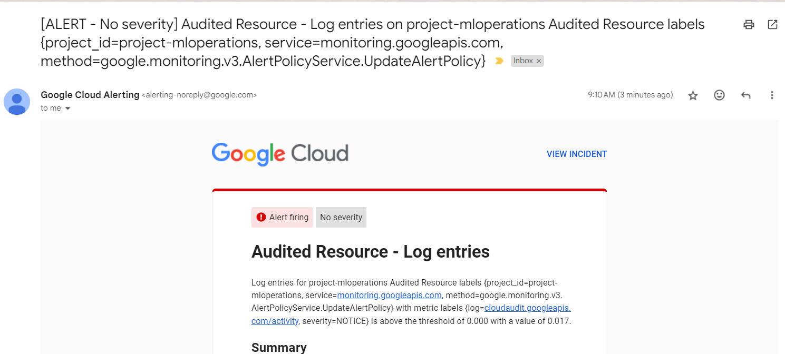
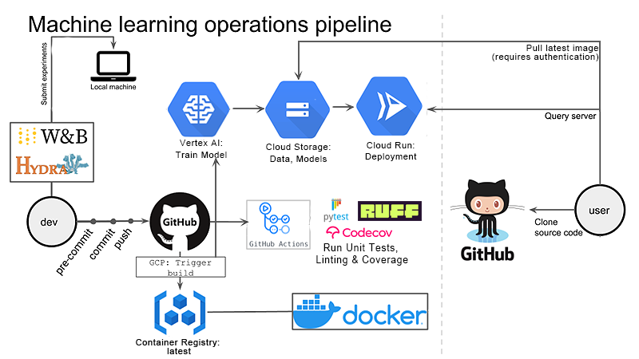

# Exam template for 02476 Machine Learning Operations

This is the report template for the exam. Please only remove the text formatted as with three dashes in front and behind
like:

``--- question 1 fill here ---``

where you instead should add your answers. Any other changes may have unwanted consequences when your report is auto
generated in the end of the course. For questions where you are asked to include images, start by adding the image to
the `figures` subfolder (please only use `.png`, `.jpg` or `.jpeg`) and then add the following code in your answer:

```markdown

```

In addition to this markdown file, we also provide the `report.py` script that provides two utility functions:

Running:

```bash
python report.py html
```

will generate an `.html` page of your report. After deadline for answering this template, we will autoscrape
everything in this `reports` folder and then use this utility to generate an `.html` page that will be your serve
as your final handin.

Running

```bash
python report.py check
```

will check your answers in this template against the constrains listed for each question e.g. is your answer too
short, too long, have you included an image when asked to.

For both functions to work it is important that you do not rename anything. The script have two dependencies that can
be installed with `pip install click markdown`.

## Overall project checklist

The checklist is *exhaustic* which means that it includes everything that you could possible do on the project in
relation the curricilum in this course. Therefore, we do not expect at all that you have checked of all boxes at the
end of the project.

### Week 1

* [X] Create a git repository
* [X] Make sure that all team members have write access to the github repository
* [X] Create a dedicated environment for you project to keep track of your packages
* [X] Create the initial file structure using cookiecutter
* [X] Fill out the `make_dataset.py` file such that it downloads whatever data you need and
* [X] Add a model file and a training script and get that running
* [X] Remember to fill out the `requirements.txt` file with whatever dependencies that you are using
* [X] Remember to comply with good coding practices (`pep8`) while doing the project
* [X] Do a bit of code typing and remember to document essential parts of your code
* [X] Setup version control for your data or part of your data
* [X] Construct one or multiple docker files for your code
* [X] Build the docker files locally and make sure they work as intended
* [X] Write one or multiple configurations files for your experiments
* [X] Used Hydra to load the configurations and manage your hyperparameters
* [ ] When you have something that works somewhat, remember at some point to to some profiling and see if
  you can optimize your code
* [X] Use Weights & Biases to log training progress and other important metrics/artifacts in your code. Additionally,
  consider running a hyperparameter optimization sweep.
* [ ] Use Pytorch-lightning (if applicable) to reduce the amount of boilerplate in your code

### Week 2

* [X] Write unit tests related to the data part of your code
* [X] Write unit tests related to model construction and or model training
* [X] Calculate the coverage.
* [X] Get some continuous integration running on the github repository
* [X] Create a data storage in GCP Bucket for you data and preferable link this with your data version control setup
* [X] Create a trigger workflow for automatically building your docker images
* [X] Get your model training in GCP using either the Engine or Vertex AI
* [X] Create a FastAPI application that can do inference using your model
* [ ] If applicable, consider deploying the model locally using torchserve
* [X] Deploy your model in GCP using either Functions or Run as the backend

### Week 3

* [X] Check how robust your model is towards data drifting
* [ ] Setup monitoring for the system telemetry of your deployed model
* [ ] Setup monitoring for the performance of your deployed model
* [ ] If applicable, play around with distributed data loading
* [ ] If applicable, play around with distributed model training
* [ ] Play around with quantization, compilation and pruning for you trained models to increase inference speed

### Additional

* [X] Revisit your initial project description. Did the project turn out as you wanted?
* [X] Make sure all group members have a understanding about all parts of the project
* [X] Uploaded all your code to github

## Group information

### Question 1

> **Enter the group number you signed up on <learn.inside.dtu.dk>**
>
> Answer: MLOps 77

Group 77

### Question 2

> **Enter the study number for each member in the group**
>
> Example:
>
> *sXXXXXX, sXXXXXX, sXXXXXX*
>
> Answer:

s233423, s237214, s232470, s232468, s232452

### Question 3

> **What framework did you choose to work with and did it help you complete the project?**
>
> Answer length: 100-200 words.
>
> Example:
> *We used the third-party framework ... in our project. We used functionality ... and functionality ... from the*
> *package to do ... and ... in our project*.
>
> Answer:

We used the Transformers package from the Huggingface group. To make our model we used ViTForImageClassification functionality from the transformers package. It created the model for fine-tuning from the already pre-trained model. For training, we used the Trainer and TrainingArguments functionality from the same package. As their name suggests the TrainingArguments was used to define training arguments like evaluation steps, number of training epochs, etc. The Trainer was used for training the model. Using this package helped us in getting introduced to them, but also took too much of our time. Having the pre-trained model was useful in not having to make our own, but figuring out how to fine-tune it, was as challenging.

## Coding environment

> In the following section we are interested in learning more about you local development environment.

### Question 4

> **Explain how you managed dependencies in your project? Explain the process a new team member would have to go**
> **through to get an exact copy of your environment.**
>
> Answer length: 100-200 words
>
> Example:
> *We used ... for managing our dependencies. The list of dependencies was auto-generated using ... . To get a*
> *complete copy of our development environment, one would have to run the following commands*
>
> Answer:

We used conda and pip to manage our dependencies in our project. Conda was used to create virtual environments with specific Python versions and pip to install packages in that environment. The list of dependencies was auto-generated using pipreqs command. To get a complete copy of our development environment, one would have to run the following commands (having conda and pip already installed on the device):
```
conda create –name myenv
conda activate myenv
pip install -r requirements.txt
pip install -r requirements_dev.txt
pip install -e .
```
To make sure that the requirements.txt file was regularly updated, each one of us would run the pipreqs command before pushing the code to github. The requirements_dev.txt file was manually updated.

### Question 5

> **We expect that you initialized your project using the 	. Explain the overall structure of your**
> **code. Did you fill out every folder or only a subset?**
>
> Answer length: 100-200 words
>
> Example:
> *From the cookiecutter template we have filled out the ... , ... and ... folder. We have removed the ... folder*
> *because we did not use any ... in our project. We have added an ... folder that contains ... for running our*
> *experiments.*
> Answer:

We initialized our project using a Cookiecutter template. From the Cookiecutter template, we populated the `src`, `data`, `tests`, `reports`, `dockerfiles`, and `models` folders. We omitted the `notebooks`, `references`, and `docs` folders as we did not utilize any Jupyter notebooks in our project. Additionally, we have no references to other projects nor specific documentation.

We added a `config` folder containing configuration files for running our model and experiments. Within the `src` folder, you will find files dedicated to data processing, model construction, training, and prediction. The `data` folder includes DVC data files. The `reports` folder comprises the report for this course. The `dockerfiles` folder is utilized to store files used for building Docker images. Finally, the `models` folder serves as the repository for our pretrained models.

### Question 6

> **Did you implement any rules for code quality and format? Additionally, explain with your own words why these**
> **concepts matters in larger projects.**
>
> Answer length: 50-100 words.
>
> Answer:

In this project, we have decided to implement good coding practices using Ruff and by employing pre-commit. The rules we have chosen to implement mostly involve checking for unnecessary whitespaces and tabs. Additionally, we have implemented checks to determine whether the imports are used or not. In large projects, there are many programmers who write code in different styles. With tools like Ruff, we ensure that the code is readable and easy to maintain. Another important benefit is that formatting helps avoid unnecessary merge conflicts.

## Version control

> In the following section we are interested in how version control was used in your project during development to
> corporate and increase the quality of your code.

### Question 7

> **How many tests did you implement and what are they testing in your code?**
>
> Answer length: 50-100 words.
>
> Example:
> *In total we have implemented X tests. Primarily we are testing ... and ... as these the most critical parts of our*
> *application but also ... .*
>
> Answer:

In total, we have implemented 12 tests. Primarily, we are testing data and the model, as these are the most critical parts of our project. Additionally, we are evaluating the training and predicting functionalities of the model. To be more precise, we have implemented tests for the following files: `test_model.py`, `train_model.py`, `predict_model.py`, `test_api.py` and `make_dataset.py`. The `test_process_data` test is ignored because it takes too long to run on each build.

### Question 8

> **What is the total code coverage (in percentage) of your code? If you code had an code coverage of 100% (or close**
> **to), would you still trust it to be error free? Explain you reasoning.**
>
> Answer length: 100-200 words.
>
> Example:
> *The total code coverage of code is X%, which includes all our source code. We are far from 100% coverage of our **
> *code and even if we were then...*
>
> Answer:

The total code coverage is 87%, which includes all our source code.. We are close to achieving 100% coverage, providing us assurance that if someone were to introduce breaking changes, we have a high chance of detecting them. While having 100% coverage would mean that every line of code is executed at least once during tests, it does not imply that our code is bug-free, as not every scenario has been thoroughly tested. This also doesn't guarantee the coverage of all code paths, edge cases, or potential issues. When writing tests for our project, we should not solely focus on code coverage but also consider the effectiveness of our tests. This involves assessing how well they can detect possible errors.

### Question 9

> **Did you workflow include using branches and pull requests? If yes, explain how. If not, explain how branches and**
> **pull request can help improve version control.**
>
> Answer length: 100-200 words.
>
> Example:
> *We made use of both branches and PRs in our project. In our group, each member had an branch that they worked on in*
> *addition to the main branch. To merge code we ...*
>
> Answer:

While working on our project, we utilized branches and pull requests. The repository comprised two main branches: `main` and `develop`. The `main` branch served as the branch for a working product, commonly referred to as production, while the `develop` branch was dedicated to ongoing development. Each group member would create a new branch from `develop` when working on a specific part of the project. After completing the work on the code, the group member would initiate a pull request to merge their changes into the `develop` branch. To ensure the quality of the written code, we implemented checks such as requiring at least one person to review it, and ensuring that the pipeline was successful.

### Question 10

> **Did you use DVC for managing data in your project? If yes, then how did it improve your project to have version**
> **control of your data. If no, explain a case where it would be beneficial to have version control of your data.**
>
> Answer length: 100-200 words.
>
> Example:
> *We did make use of DVC in the following way: ... . In the end it helped us in ... for controlling ... part of our*
> *pipeline*
>
> Answer:

We used DVC in our project. It started out as a google drive based storage, but later on in the project when introducing GCP we switched to a GCP storage bucket. During the project we had trouble with the size of our dataset (200k images), DVC helped us because we had to change the way the dataset is formatted multiple times, each of these reformations would take some time to run on our PCs so having it be "in the cloud" helped with ease of use. Thankfully we did not need to revert back to "previous" versions of the data, but with a few different versions there was a chance we would have needed this functionality as well.

### Question 11

> **Discuss you continues integration setup. What kind of CI are you running (unittesting, linting, etc.)? Do you test**
> **multiple operating systems, python version etc. Do you make use of caching? Feel free to insert a link to one of**
> **your github actions workflow.**
>
> Answer length: 200-300 words.
>
> Example:
> *We have organized our CI into 3 separate files: one for doing ..., one for running ... testing and one for running*
> *... . In particular for our ..., we used ... .An example of a triggered workflow can be seen here: `<weblink>`*
>
> Answer:

Our CI consists of three workflow files, one for running tests, one for running pre-commit and one to allow PRs on main branch only from the develop branch. The test.yml workflow, as can be concluded from the name, is used to run tests on opening a PR to main and develop. It tests only one version of python and one OS, because all the code that is being used is used in containerized environments. We had some trouble with this workflow as our data is saved on DVC in a .zip format (because DVC was too slow with a lot of files). This was handled by installing the "unzip" package in the workflow container, and unziping newly pulled data everytime the workflow is ran. To be able to pull data on each run, we had to use gcloud-github-actions functions, we authenticate our runs by using a github repository secret containing the JSON key file that is generated by gcloud. An example of a triggered workflow can be seen [here](https://github.com/nmarg/Project-MLOperations/actions/runs/7553894489/job/20565629910). Adding to this we have also setup codecov, for making sure the test coverage of the project stays as high as possible. The pre-commit workflow, installs pre-commit and runs ruff format, if something stays unfixed the workflow fails and the PR to develop or main cannot be merged as it is set as a required check.

## Running code and tracking experiments

> In the following section we are interested in learning more about the experimental setup for running your code and
> especially the reproducibility of your experiments.

### Question 12

> **How did you configure experiments? Did you make use of config files? Explain with coding examples of how you would**
> **run a experiment.**
>
> Answer length: 50-100 words.
>
> Example:
> *We used a simple argparser, that worked in the following way: python my_script.py --lr 1e-3 --batch_size 25*
>
> Answer:

Our experiments are configured through config files. We use only one file; `config/model/model_config.yaml`. Inside this file it is possible to change different hyperparameters such as batch size, epochs,... and settings. This is read by [hydra](https://hydra.cc/docs/intro/) and provided as the configuration in the experiment.
Running the experiment is very simple:
* edit the config file to fit your experiment needs
* run the script:
```
python src/train_model.py
```

### Question 13

> **Reproducibility of experiments are important. Related to the last question, how did you secure that no information**
> **is lost when running experiments and that your experiments are reproducible?**
>
> Answer length: 100-200 words.
>
> Example:
> *We made use of config files. Whenever an experiment is run the following happens: ... . To reproduce an experiment*
> *one would have to do ...*
>
> Answer:

Inside the `config/model/model_config.yaml` there is a bool setting called `reproducible_experiment`. When set to `True`, the `seed` setting (also in the .yaml file) is set in the experiment, ensuring that the randomness is reproducible across multiple runs. All of the other hyperparameters are already provided in the `config.yaml`. Hydra automatically saves its configuration to `outputs/`, and then in subfolders by day and time. To rerun an experiment with the same hyperparameters, you would have to run the `train.py` file while providing hydra with the path to the saved configuration. The call would look like:
```
python src/train.py --config-path /path/to/your/outputs/YYYY-MM-DD/HH-MM-SS --config-name config.yaml
```
### Question 14

> **Upload 1 to 3 screenshots that show the experiments that you have done in W&B (or another experiment tracking**
> **service of your choice). This may include loss graphs, logged images, hyperparameter sweeps etc. You can take**
> **inspiration from [this figure](figures/wandb.png). Explain what metrics you are tracking and why they are**
> **important.**
>
> Answer length: 200-300 words + 1 to 3 screenshots.
>
> Example:
> *As seen in the first image when have tracked ... and ... which both inform us about ... in our experiments.*
> *As seen in the second image we are also tracking ... and ...*
>
> Answer:

This first screenshot represents how the different model configurations (size of test set, learning rate) turned out to perform.



We are tracking different metrics, such as loss per step, loss changing in time etc.

Next figure shows how logs of actual data points(celebrity images) and the model's predictions look like in W&B.
Such logs could be useful for better grasping of how the model behaves - what it outputs for specific entries.


The following diagram shows the behaviour of all of our model prediction runs. Unfortunately, the Predicted variable is equal to 1 (meaning `Not attractive`).
If our model were to work properly, the Predicted variable should show around the average value of 0,5.



Also, the `precision` variable for all 5000 test images is 0,0. That means that the model does not correctly predict any images labeled as `Attractive`. Of course, the variable would come in handy, as the main measure of the model. Finally, we can conclude that the logging using Weights&Biases is setup and is useful for a proper model.

Note: after two days of debugging why the model was not training well we scraped the model optimization and decided to focus on the operations part of the project.

### Question 15

> **Docker is an important tool for creating containerized applications. Explain how you used docker in your**
> **experiments? Include how you would run your docker images and include a link to one of your docker files.**
>
> Answer length: 100-200 words.
>
> Example:
> *For our project we developed several images: one for training, inference and deployment. For example to run the*
> *training docker image: `docker run trainer:latest lr=1e-3 batch_size=64`. Link to docker file: `<weblink>`*
>
> Answer:

Docker was used to containerize two applications in relation to our model: the [trainer](https://github.com/nmarg/Project-MLOperations/blob/main/dockerfiles/train.dockerfile) and the [predict server](https://github.com/nmarg/Project-MLOperations/blob/main/dockerfiles/server.dockerfile). The `trainer` image runs model training on data stored in our cloud bucket, while the `predict server` is built with a model to be deployed. Neither of these images had arguments when running them, as they were built with a config file embedded inside. Even though this could be optimized for configurability, we decided to stay with the config file approach and instead focus on the pipeline around the images. Therefore, to run for example predict server, we'd call: `docker run -p 8080:8080 predict_server:latest`. We had experimented with setting the port with a `$PORT` variable for the server, but found no use for it as we would use a constant port in the cloud anyway.


### Question 16

> **When running into bugs while trying to run your experiments, how did you perform debugging? Additionally, did you**
> **try to profile your code or do you think it is already perfect?**
>
> Answer length: 100-200 words.
>
> Example:
> *Debugging method was dependent on group member. Some just used ... and others used ... . We did a single profiling*
> *run of our main code at some point that showed ...*
>
> Answer:

The debugging method was dependent on the group member. Some used print statements throughout our code, while others employed the built-in Python debugger. In the event that a team member was unsuccessful in debugging, he/she would reach out to another team member for help. This approach allowed us to solve problems more quickly, practice good teamwork, and gain insight into other people’s tasks. We decided against profiling, as most of the code that could run slowly was taken from the transformers package. This makes our optimization significantly harder and more time-consuming. Furthermore, we believe that the rest of the written code runs well, as we have implemented the code review practice, ensuring that it performs at its fastest potential.

## Working in the cloud

> In the following section we would like to know more about your experience when developing in the cloud.

### Question 17

> **List all the GCP services that you made use of in your project and shortly explain what each service does?**
>
> Answer length: 50-200 words.
>
> Example:
> *We used the following two services: Engine and Bucket. Engine is used for... and Bucket is used for...*
>
> Answer:

We used the following services in Google Cloud Platform for our project:
 - Cloud Storage: Bucket for training data and saved models
 - Cloud Build: Triggering an automated CI/CD pipeline with Cloud Triggers that sets up an environment, builds our docker images, then deploys the predict server to Cloud Run, all set up in cloudbuild.yaml. Images are stored in the Container Registry.
 - Cloud Run: Serverless deployment of our predict model based on the latest image built by Cloud Build.
 - Vertex AI: VM for training the model from the image built by Cloud build.

### Question 18

> **The backbone of GCP is the Compute engine. Explained how you made use of this service and what type of VMs**
> **you used?**
>
> Answer length: 100-200 words.
>
> Example:
> *We used the compute engine to run our ... . We used instances with the following hardware: ... and we started the*
> *using a custom container: ...*
>
> Answer:

We used the Cloud build to first build our containers in the cloud and then deploy them. For the server, we used the Cloud run, while for training we used Vertex AI. Cloud run was chosen for hosting our server and our trained model, as it scales automatically and stays deployed. Vertex AI on the other hand, was used as it provided us with a VM that spins up, trains the model, saves it and terminates, not wasting additional resources. Unfortunatelly we didn't get access to additional quotas in time, so we used the n1-standard-8 machine type without GPU acceleration.

### Question 19

> **Insert 1-2 images of your GCP bucket, such that we can see what data you have stored in it.**
> **You can take inspiration from [this figure](figures/bucket.png).**
>
> Answer:




### Question 20

> **Upload one image of your GCP container registry, such that we can see the different images that you have stored.**
> **You can take inspiration from [this figure](figures/registry.png).**
>
> Answer:



### Question 21

> **Upload one image of your GCP cloud build history, so we can see the history of the images that have been build in**
> **your project. You can take inspiration from [this figure](figures/build.png).**
>
> Answer:



### Question 22

> **Did you manage to deploy your model, either in locally or cloud? If not, describe why. If yes, describe how and**
> **preferably how you invoke your deployed service?**
>
> Answer length: 100-200 words.
>
> Example:
> *For deployment we wrapped our model into application using ... . We first tried locally serving the model, which*
> *worked. Afterwards we deployed it in the cloud, using ... . To invoke the service an user would call*
> *`curl -X POST -F "file=@file.json"<weburl>`*
>
> Answer:

In addition to creating a local FastAPI server for our model, we managed to create an automated CD pipeline in the cloud, which works in the following way: every time there is a new push (or merge) to our main GitHub branch, a Google Cloud Trigger is invoked, that operates based on the instructions described in `cloudbuild/cloudbuild_server.yaml`. This, in turn, builds the FastAPI server into a Docker Image based on the new push into the codebase, pushes that image to the Google Container Registry, then creates a new deployment using Google Cloud Run based on the latest image. After the pipeline is finished, a prediction for an image saved locally may be requested in a terminal with the command `curl -F "data=@<imagename>.jpg" -POST https://predict-server-axvushlxya-ew.a.run.app/predict/` (this is the actual URL of our deployment).

### Question 23

> **Did you manage to implement monitoring of your deployed model? If yes, explain how it works. If not, explain how**
> **monitoring would help the longevity of your application.**
>
> Answer length: 100-200 words.
>
> Example:
> *We did not manage to implement monitoring. We would like to have monitoring implemented such that over time we could*
> *measure ... and ... that would inform us about this ... behaviour of our application.*
>
> Answer:

We added monitoring for data drifting to the deployed model. When accessing the link `https://predict-server-axvushlxya-ew.a.run.app/data-drifting-report/` a report is generated by the `evidently` package that compares the reference data (the one the model was trained on) with the current data (the data being used on the deployed model). Since there are a limited amount of observations in the current data, drifting is detected on 3 out of the 4 columns, but this is expected.

Using the Google Cloud Monitoring service, we set up the basic system telemetry. For example, we can track the log count using the policy we created, and when certain tresholds are not met, the e-mail notification channel reports it.

Here is how the monitoring diagram looks:


The next figure shows the log entries, as seen in Google Cloud Monitoring:


We managed to get the e-mail alerts notifications to work :


### Question 24

> **How many credits did you end up using during the project and what service was most expensive?**
>
> Answer length: 25-100 words.
>
> Example:
> *Group member 1 used ..., Group member 2 used ..., in total ... credits was spend during development. The service*
> *costing the most was ... due to ...*
>
> Answer:

For the project only the service account of one member was used. The total cost ended up being around $10, the reason for the low consumption is that we did not get the quota for a GPU in time so we only used CPUs. The service that used up most of the credits was taken up by Cloud storage (90%) and the rest was Cloud run and Vertex AI.

## Overall discussion of project

> In the following section we would like you to think about the general structure of your project.

### Question 25

> **Include a figure that describes the overall architecture of your system and what services that you make use of.**
> **You can take inspiration from [this figure](figures/overview.png). Additionally in your own words, explain the**
> **overall steps in figure.**
>
> Answer length: 200-400 words
>
> Example:
>
> *The starting point of the diagram is our local setup, where we integrated ... and ... and ... into our code.*
> *Whenever we commit code and puch to github, it auto triggers ... and ... . From there the diagram shows ...*
>
> Answer:



The starting point of the diagram is our local setup, where we integrated Hydra, conda, pip, pre-commit (with ruff) and many more into our code. We added CI that runs tests and pre-commit upon opening a PR to develop or main. If there is a push to main we have CD that automatically builds the docker image for the deployed model server and hosts it on Cloud run. There is also a manual trigger on Cloud build for building the docker image for training a new model and running it in a Vertex AI VM, which can be accessed through the GCP console. Weights&Biases and Hydra are used in the training process. As can be seen from the diagram, an external user can clone our source code and query our deployed model server. Inside the main README of the project there is a guide on how to query the server correctly.

### Question 26

> **Discuss the overall struggles of the project. Where did you spend most time and what did you do to overcome these**
> **challenges?**
>
> Answer length: 200-400 words.
>
> Example:
> *The biggest challenges in the project was using ... tool to do ... . The reason for this was ...*
>
> Answer:

* DVC \
  We ran into a lot of troubles while setting up DVC and using the cloud. As DVC works with git, when some of the files tracked by DVC were changed from the cloud (these changes were not tracked by git), we ran into a lot of 404 File Not Found errors because the versions provided in our project did not match those found in the cloud. We decided to remove those files from DVC, and only access them through cloud.
* hugging face transformers library \
  Our first plan was to make multilabel inference on 40 attributes, but we ran into a lot of problems with the library. The documentation on the multilabel problems for images was almost non-existant and so we were forced to move to a single label prediction.
* python imports\
  Python imports turned out to be harder to implement across multiple enviroments than expected. It was difficult to allign the paths for tests, local training and deployment and containerized applications. For the containers a new path (project path) had to be added to the python path ENV in order for the app to work.

### Question 27

> **State the individual contributions of each team member. This is required information from DTU, because we need to**
> **make sure all members contributed actively to the project**
>
> Answer length: 50-200 words.
>
> Example:
> *Student sXXXXXX was in charge of developing of setting up the initial cookie cutter project and developing of the*
> *docker containers for training our applications.*
> *Student sXXXXXX was in charge of training our models in the cloud and deploying them afterwards.*
> *All members contributed to code by...*
>
> Answer:

Student s233423 was in charge of processing the original data, Cloud run model deployment, meeting organization. Student s237214 was in charge of Weights&Biases logging and monitoring. Student s232470 was in charge of setting up DVC, Cloud build, CI. Student s232468 was in charge of testing, CI and model training (trying really hard). Student s232452 was in charge of Vertex AI, FastAPI server, model training and IT support. All members contributed to the report, by answering the questions related to the parts they did. We also contributed to helping each other whenever the need for it arose <3.
